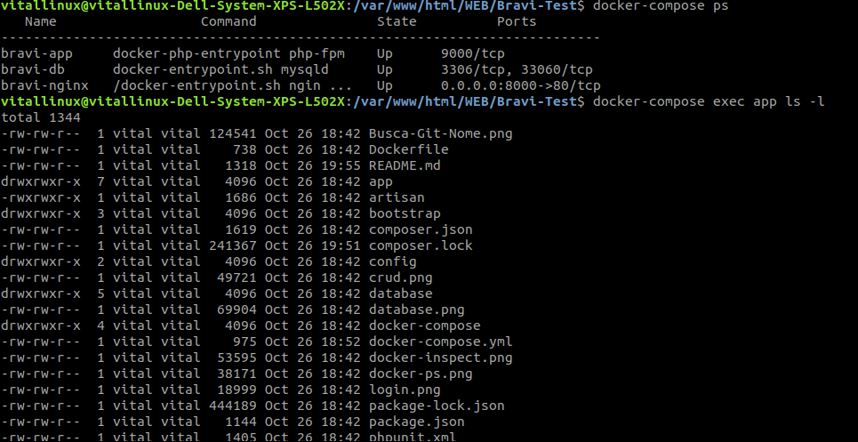
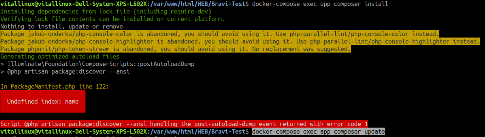
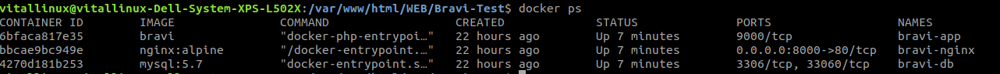
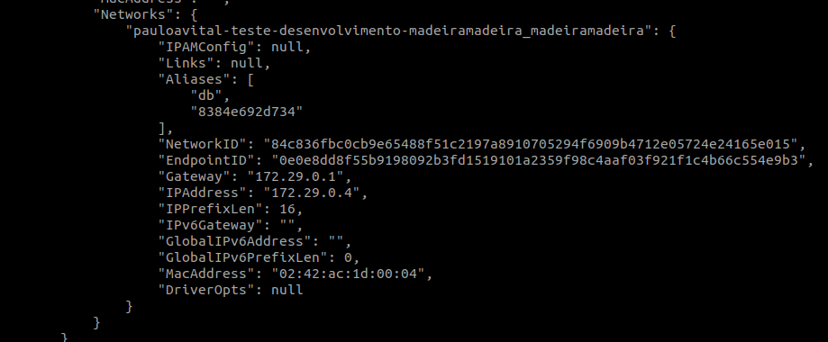
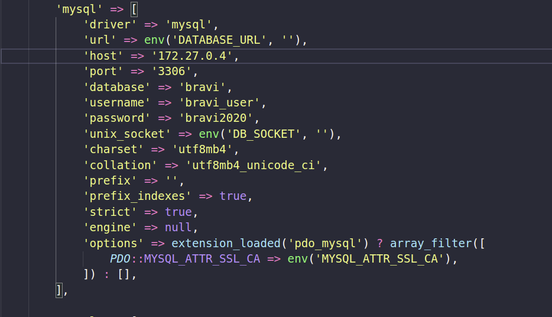

# Teste-Desenvolvimento-Bravi

---
## Subindo o Docker para rodar o app
1. **sudo docker-compose build app**
2. **sudo docker-compose up -d**
3. 

---
## Instalar as dependências do composer
4. **docker-compose exec app composer install**
4.0.  

## Caso gere um erro
4.1. **docker-compose exec app composer update**

---

## crie uma chave para o artisan
5. **docker-compose exec app php artisan key:generate**

---

## Verifique o host do mysql que o Docker gerou

Comando no terminal:

6.0. **docker ps**

6.1. **docker inspect _id do mysql_**

6.3. Copie o numero do IPAddress 
* Ex:  _172.29.0.4_
---

## Edit o host do mysql
7. **Abra o arquivo database.php linha 49 e coloque o host que o docker gerou**

---

8. Acesse o **_http://localhost:8000/_**